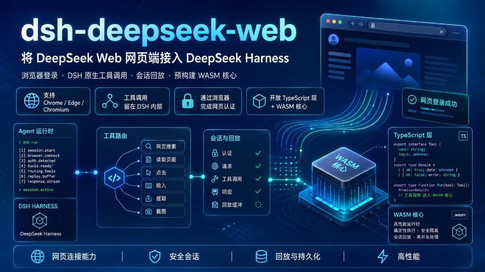
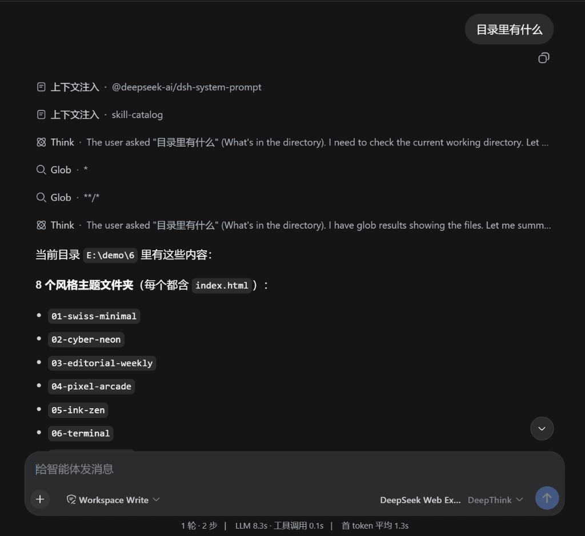
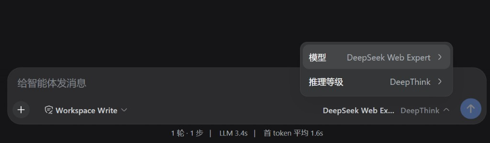
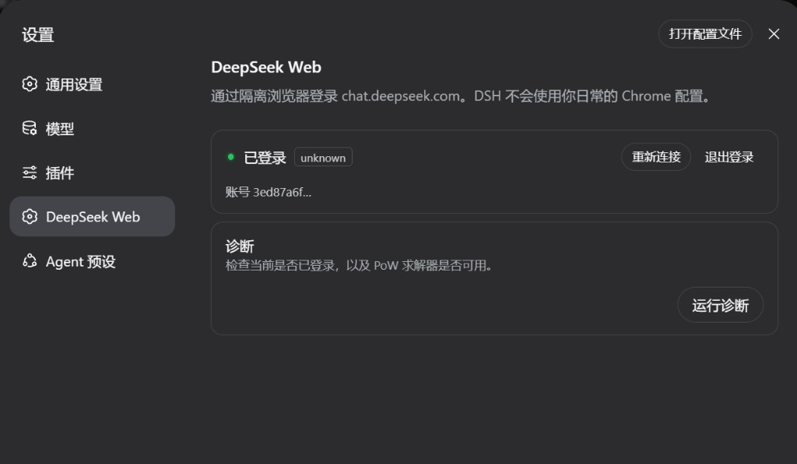

<div align="center">

# dsh-deepseek-web

**Connect DeepSeek Web to DeepSeek Harness**

[English](./README.en.md) · [中文](./README.md) · [Install](./INSTALL.md) · [npm](https://www.npmjs.com/package/dsh-deepseek-web)

[](https://www.npmjs.com/package/dsh-deepseek-web)
[](https://github.com/y-wi/dsh-deepseek-web/releases)
[](./LICENSE)
[](https://nodejs.org)

<p>
  
</p>

**Open TypeScript integration layer** · precompiled WASM protocol core  

<h3>
Please follow the applicable usage policies. Do not use this project for reverse proxies or other behavior that disrupts normal system operation. Personal learning use only.
  
</h3>

<h3>
<em>Want to quickly build an agent of your own? Try <a href="https://github.com/aifluxon/aifluxon">AIFLUXON</a>: an embeddable Agent runtime with Rust secondary development and a Python API, so you can quickly connect AI into existing programs. It unifies streaming, tools, approvals, sessions, cancellation, and budgets — for AI apps, Coding Agents, CLIs, and custom Hosts.</em>
</h3>

</div>


Unofficial provider. This repository publishes the Harness **integration and transport** layer. Protocol compatibility ships as precompiled WebAssembly.

This project is **not affiliated with or endorsed by DeepSeek**. Users sign in with their own account. The plugin does not bypass CAPTCHA, WAF, or account controls; interactive challenges complete in an isolated browser window.


## Screenshots

### Session, reasoning, and tools

<p align="center">
  
</p>

**Session and tool calls.** The user asks what is in the workspace. DeepThink is planning only; `Glob` is executed by DeepSeek Harness. The plugin translates model output into tool requests and **never** runs the filesystem itself.

### Model and DeepThink

<p align="center">
  
</p>

**Composer.** Switch `DeepSeek Web` / `DeepSeek Web Expert` and the DeepThink reasoning level. The footer reports turn timing and time-to-first-token.

### Isolated browser login

<p align="center">
  
</p>

**Settings.** Sign in to `chat.deepseek.com` with a dedicated browser profile, not everyday Chrome or Edge. Status, reconnect, logout, and PoW diagnostics live here. Credentials stay in DSH storage.

## Capabilities

| Capability | Detail |
| --- | --- |
| Browser login | Isolated `--user-data-dir`; never the everyday browser profile |
| Native DSH tools | Text tool bridge → `ToolCallBlock`; FS / Shell / MCP / approval run in Harness |
| Session replay | Continue a DSH session and rebuild remote context |
| Prebuilt WASM | No Rust / wasm-pack on install; tokens and cookies **never enter** WASM |

## Architecture

| Layer | Responsibility |
| --- | --- |
| Open TypeScript layer | HTTP, SSE, browser login, credentials, DSH adapter, tool bridge, replay |
| Precompiled WASM core | Protocol compatibility and PoW |

DeepSeek Web has no official function calling. The plugin only parses model output. The adapter **never** executes shell, filesystem, or MCP.

## Install

Requires DeepSeek Harness **0.1.0-rc.7** (or compatible) and Node `^22.19.0 || >=24.0.0`.

```bash
dsh plugin --profile web add dsh-deepseek-web
dsh plugin --profile web peers check
dsh web
```

Settings → DeepSeek Web → Sign in with DeepSeek. Confirm provider `deepseek-web` and models `default` / `expert`.

DSH / Cordis / React come from `$DSH_HOME/profiles/node_modules`. They are not duplicated under the plugin package.

<details>
<summary>TUI, CLI, and updates</summary>

```bash
dsh plugin --profile dsh-tui add dsh-deepseek-web
dsh-tui
```

```bash
dsh plugin --profile web exec dsh-deepseek-web status
dsh plugin --profile web exec dsh-deepseek-web login
dsh plugin --profile web update dsh-deepseek-web
```

Headless fallback (not a substitute for browser login):

```bash
dsh plugin --profile web exec dsh-deepseek-web login --token-stdin
```

See [INSTALL.md](./INSTALL.md) for the full notes.

</details>

## Models

| ID | Description |
| --- | --- |
| `deepseek-web/default` | DeepSeek Web |
| `deepseek-web/expert` | DeepSeek Web Expert |

Thinking is `on` / `off`. Native web search is off by default. Input modalities are **text-only**.

## Safety

- Never print `.credentials.yaml`, Bearer tokens, CDP endpoints, or absolute browser profile paths
- Login uses only the plugin-owned isolated profile
- Credentials are stored only in DSH

See [SECURITY.md](./SECURITY.md) and [docs/browser-auth.md](./docs/browser-auth.md).

## Docs

- [Install](./INSTALL.md)
- [Contributing](./CONTRIBUTING.md)
- [Releases](https://github.com/y-wi/dsh-deepseek-web/releases)
- [中文 README](./README.md)

## License

MIT for the TypeScript integration layer. See [LICENSE](./LICENSE) and [LICENSES/PROTOCOL_CORE.txt](./LICENSES/PROTOCOL_CORE.txt) for the precompiled core. Notices: [THIRD_PARTY_NOTICES.md](./THIRD_PARTY_NOTICES.md).
